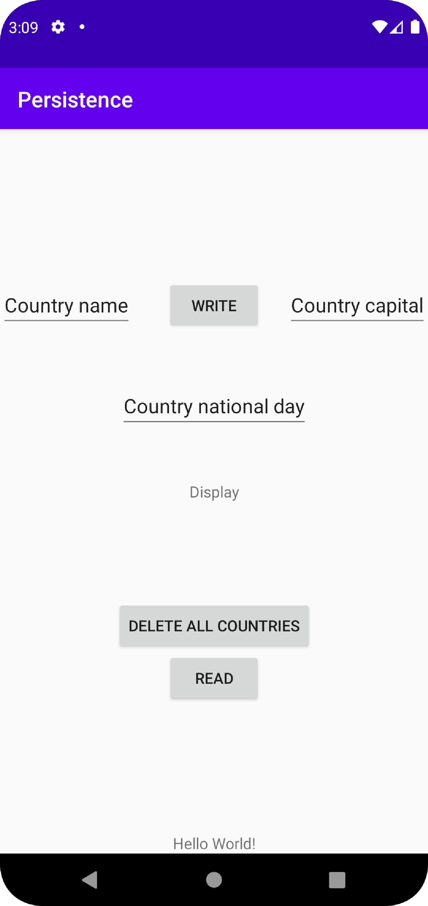
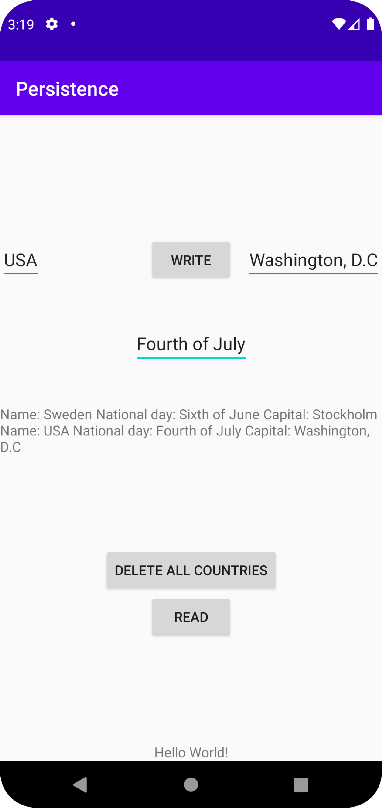

# Rapport

Variablerna blir deklarerade.

```
    private Button read, write, delete;
    private TextView display;
    private EditText countryName, countryNationalDay, countryCapital;

    private SQLiteDatabase database;
    private DatabaseHelper databaseHelper;
```

Views blir initialiserade till views i layouten.

```
        read = findViewById(R.id.Read);
        write = findViewById(R.id.Write);
        delete = findViewById(R.id.Delete);
        display =findViewById(R.id.Display);
        countryName = findViewById(R.id.Country_name);
        countryNationalDay = findViewById(R.id.Country_national_day);
        countryCapital = findViewById(R.id.Country_capital);
```

"databaseHelper" blir initialiserad till en "DatabaseHelper" med kontexten this.

```
        databaseHelper = new DatabaseHelper(this);
```

"write" knappen hämtar "EditText" texterna och sätter in ett land med dem värdena i databasen när den blir klickad.

```
        write.setOnClickListener(new View.OnClickListener() {
            @Override
            public void onClick(View view) {
                String name = countryName.getText().toString();
                String nationalDay = countryNationalDay.getText().toString();
                String capital = countryCapital.getText().toString();

                ContentValues values = new ContentValues();
                values.put(DatabaseTables.Country.COLUMN_NAME_NAME, name);
                values.put(DatabaseTables.Country.COLUMN_NAME_NATIONAL_DAY, nationalDay);
                values.put(DatabaseTables.Country.COLUMN_NAME_CAPITAL, capital);
                database.insert(DatabaseTables.Country.TABLE_NAME, null, values);
            }
        });
```

"read" knappen visar länderna i databasen när den blir klickad.

```
        read.setOnClickListener(new View.OnClickListener() {
            @Override
            public void onClick(View view) {
                displayCountries();
            }
        });
```

"delete" knappen tar bort alla länder i databasen när den blir klickad.

```
        delete.setOnClickListener(new View.OnClickListener() {
            @Override
            public void onClick(View view) {
                deleteAllCountries();
            }
        });
```

Gör en "Cursor" som används för att gå igenom databasen för länder och sätter ländernas namn, nationaldag och storstad i en sträng som sen visas i "display" viewen.

```
    private void displayCountries() {
        Cursor cursor = database.query(DatabaseTables.Country.TABLE_NAME, null, null, null, null, null, null);
        String text = "";
        while (cursor.moveToNext()) {
            Country country = new Country(
                    cursor.getLong(cursor.getColumnIndexOrThrow(DatabaseTables.Country.COLUMN_NAME_ID)),
                    cursor.getString(cursor.getColumnIndexOrThrow(DatabaseTables.Country.COLUMN_NAME_NAME)),
                    cursor.getString(cursor.getColumnIndexOrThrow(DatabaseTables.Country.COLUMN_NAME_NATIONAL_DAY)),
                    cursor.getString(cursor.getColumnIndexOrThrow(DatabaseTables.Country.COLUMN_NAME_CAPITAL))
            );
            text += "Name: " + country.getName() + " National day: " + country.getNationalDay() + " Capital: " + country.getCapital() + "\n";
        }
        cursor.close();
        display.setText(text);
    }
```

Tar bort alla länder i databasen.

```
    private void deleteAllCountries() {
        database.delete(DatabaseTables.Country.TABLE_NAME, null, null);
    }
```

"DatabaseTables" klass för "Country" som kan både skapa och ta bort "Country" tabeller.

```
package com.example.persistence;

class DatabaseTables {

    static class Country {

        static final String TABLE_NAME = "country";
        static final String COLUMN_NAME_ID = "id";
        static final String COLUMN_NAME_NAME = "name";
        static final String COLUMN_NAME_NATIONAL_DAY = "national_day";
        static final String COLUMN_NAME_CAPITAL = "capital";

    }

    static final String SQL_CREATE_TABLE_COUNTRY =
            // "CREATE TABLE mountain (id INTEGER PRIMARY KEY, name TEXT, national day TEXT, capital TEXT)"
            "CREATE TABLE " + Country.TABLE_NAME + " (" +
                    Country.COLUMN_NAME_ID + " INTEGER PRIMARY KEY," +
                    Country.COLUMN_NAME_NAME + " TEXT," +
                    Country.COLUMN_NAME_NATIONAL_DAY + " TEXT," +
                    Country.COLUMN_NAME_CAPITAL + " TEXT)";

    static final String SQL_DELETE_TABLE_COUNTRY =
            // "DROP TABLE IF EXISTS country"
            "DROP TABLE IF EXISTS " + Country.TABLE_NAME;

}

```

"DatabaseHelper" klass som ärver från "SQLiteOpenHelper" som hjälper med livscykeln av en databas som hanterar "Country" tabeller.

```
package com.example.persistence;

import android.content.Context;
import android.database.sqlite.SQLiteDatabase;
import android.database.sqlite.SQLiteOpenHelper;

public class DatabaseHelper extends SQLiteOpenHelper {

    private static final int DATABASE_VERSION = 1; // If this is incremented onUpgrade() will be executed
    private static final String DATABASE_NAME = "Country.db"; // The file name of our database

    DatabaseHelper(Context context) {
        super(context, DATABASE_NAME, null, DATABASE_VERSION);
    }

    // This method is executed only if there is not already a database in the file `Mountain.db`
    @Override
    public void onCreate(SQLiteDatabase sqLiteDatabase) {
        sqLiteDatabase.execSQL(DatabaseTables.SQL_CREATE_TABLE_COUNTRY);
    }

    // This method is executed only if the database version has changed, e.g. from 1 to 2
    @Override
    public void onUpgrade(SQLiteDatabase sqLiteDatabase, int oldVersion, int newVersion) {
        sqLiteDatabase.execSQL(DatabaseTables.SQL_DELETE_TABLE_COUNTRY);
        onCreate(sqLiteDatabase);
    }

}

```

"Country" klass med variablerna "id", "name", "nationalDay" och "capital" som sätts i konstruktorn och hämtas med getters.

```
package com.example.persistence;

public class Country {

    private Long id;
    private String name;
    private String nationalDay;
    private String capital;

    public Country(Long id, String name, String nationalDay, String capital) {
        this.id = id;
        this.name = name;
        this.nationalDay = nationalDay;
        this.capital = capital;
    }

    public Long getId() {
        return id;
    }

    public String getName() {
        return name;
    }

    public String getNationalDay() {
        return nationalDay;
    }

    public String getCapital() {
        return capital;
    }
}

```

En "TextView" med ID "Display" som ska bli ändrad till att visa texten med ländernas namn, nationaldag och storstad.

```
    <TextView
        android:id="@+id/Display"
        android:layout_width="wrap_content"
        android:layout_height="wrap_content"
        android:text="Display"
        app:layout_constraintBottom_toBottomOf="parent"
        app:layout_constraintLeft_toLeftOf="parent"
        app:layout_constraintRight_toRightOf="parent"
        app:layout_constraintTop_toTopOf="parent" />
```

En "Button" med ID "Read" som ska ändra "Display" till att visa texten med ländernas namn, nationaldag och storstad när den blir klickad.

```
    <Button
        android:id="@+id/Read"
        android:layout_width="wrap_content"
        android:layout_height="wrap_content"
        android:text="Read"
        app:layout_constraintBottom_toBottomOf="parent"
        app:layout_constraintLeft_toLeftOf="parent"
        app:layout_constraintRight_toRightOf="parent"
        app:layout_constraintTop_toBottomOf="@+id/Display" />
```

En "Button" med ID "Write" som ska hämta texterna från "Country_name", "Country_national_day" och "Country_capital" när den blir klickad.

```
    <Button
        android:id="@+id/Write"
        android:layout_width="wrap_content"
        android:layout_height="wrap_content"
        android:text="Write"
        app:layout_constraintBottom_toTopOf="@+id/Display"
        app:layout_constraintLeft_toLeftOf="parent"
        app:layout_constraintRight_toRightOf="parent"
        app:layout_constraintTop_toTopOf="parent" />
```

En "Button" med ID "Delete" som ska radera alla länder från databasen när den blir klickad.

```
    <Button
        android:id="@+id/Delete"
        android:layout_width="wrap_content"
        android:layout_height="wrap_content"
        android:text="Delete all countries"
        app:layout_constraintBottom_toTopOf="@+id/Read"
        app:layout_constraintLeft_toLeftOf="parent"
        app:layout_constraintRight_toRightOf="parent" />
```

En "EditText" med ID "Country_name" som ska användas för att skriva in landets namn.

```
    <EditText
        android:id="@+id/Country_name"
        android:layout_width="wrap_content"
        android:layout_height="wrap_content"
        android:text="Country name"
        app:layout_constraintBottom_toTopOf="@+id/Display"
        app:layout_constraintLeft_toLeftOf="parent"
        app:layout_constraintTop_toTopOf="parent" />
```

En "EditText" med ID "Country_national_day" som ska användas för att skriva in landets nationaldag.

```
    <EditText
        android:id="@+id/Country_national_day"
        android:layout_width="wrap_content"
        android:layout_height="wrap_content"
        android:text="Country national day"
        app:layout_constraintBottom_toTopOf="@+id/Display"
        app:layout_constraintEnd_toEndOf="parent"
        app:layout_constraintLeft_toLeftOf="parent"
        app:layout_constraintStart_toStartOf="@+id/Country_name"
        app:layout_constraintTop_toBottomOf="@+id/Write" />
```

En "EditText" med ID "Country_capital" som ska användas för att skriva in landets storstad.

```
    <EditText
        android:id="@+id/Country_capital"
        android:layout_width="wrap_content"
        android:layout_height="wrap_content"
        android:text="Country capital"
        app:layout_constraintBottom_toTopOf="@+id/Display"
        app:layout_constraintEnd_toEndOf="parent"
        app:layout_constraintTop_toTopOf="parent" />
```

Skärmdump av appen i början.



Skärmdump av appen när ett land har skrivits in i databasen och blivit läst.


Skärmdump av appen när två länder har skrivits in i databasen och blivit lästa.

